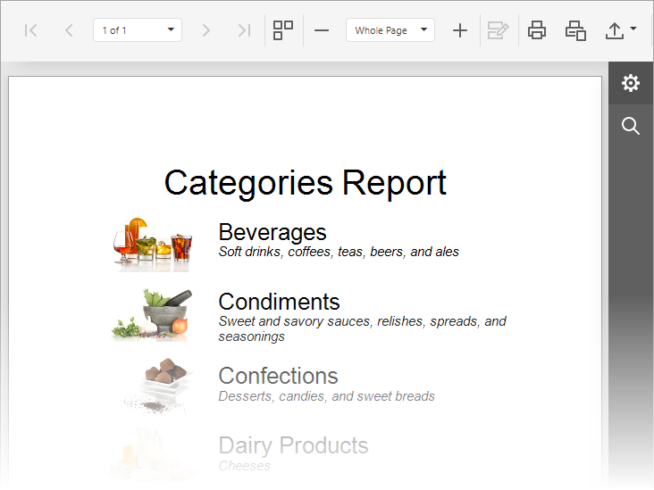

<!-- default badges list -->

<!-- default badges end -->
# How to Generate a Report at Runtime in an ASP.NET MVC Application

This example demonstrates how to generate a report at runtime and preview it in the Document Viewer or edit it in the Report Designer. 

In this example the Document Viewer and Report Designer components use a custom service to get a report instance by name. The custom service (CustomReportProvider) implements the [IReportProvider](https://docs.devexpress.com/XtraReports/DevExpress.XtraReports.Services.IReportProvide) interface, and its [GetReport](https://docs.devexpress.com/XtraReports/DevExpress.XtraReports.Services.IReportProvider.GetReport(System.String-DevExpress.XtraReports.Services.ReportProviderContext)) method generates a report instance at runtime.

On the Document Viewer page, the report name is passed to the [Bind](https://docs.devexpress.com/AspNetMvc/DevExpress.Web.Mvc.WebDocumentViewerExtension.Bind.overloads) method of [WebDocumentViewerExtension](https://docs.devexpress.com/AspNetMvc/DevExpress.Web.Mvc.WebDocumentViewerExtension).

On the Report Designer page, the report name is passed to the [Bind](https://docs.devexpress.com/AspNetMvc/DevExpress.Web.Mvc.ReportDesignerExtension.Bind.overloads) method. To save reports, the Report Designer calls the CustomReportStorageWebExtension service that is the [ReportStorageWebExtension](https://docs.devexpress.com/XtraReports/DevExpress.XtraReports.Web.Extensions.ReportStorageWebExtension) class descendant.
 

<!-- default file list -->

## Files to Look At

- [CustomReportProvider.cs](CS/ReportAtRuntimeMvcApp/Services/CustomReportProvider.cs) ([CustomReportProvider.vb](VB/ReportAtRuntimeMvcApp/ReportAtRuntimeMvcApp/Services/CustomReportProvider.vb))
- [Global.asax.cs](CS/ReportAtRuntimeMvcApp/Global.asax.cs) ([Global.asax.vb](VB/ReportAtRuntimeMvcApp/ReportAtRuntimeMvcApp/Global.asax.vb))

<!-- default file list end -->

## Documentation

- [Create Reports in Code](https://docs.devexpress.com/XtraReports/115726/detailed-guide-to-devexpress-reporting/reporting-api/create-reports-in-code)
- [Bind a Report to a Microsoft SQL Server Database at Runtime](https://docs.devexpress.com/XtraReports/4793/detailed-guide-to-devexpress-reporting/bind-reports-to-data/sql-database/bind-a-report-to-a-microsoft-sql-server-database-runtime-sample)
- [ASP.NET MVC Reporting](https://docs.devexpress.com/XtraReports/400247/web-reporting/asp-net-mvc-reporting)

## More Examples

- [How to programmatically generate ObjectDataSource and map object data source constructor parameters to report parameters](https://github.com/DevExpress-Examples/Reporting_how-to-programmatically-generate-objectdatasource-and-map-object-data-source-t415910)
